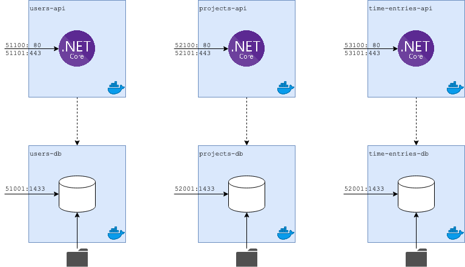

# dotnet-microservices
Trying to setup multiple connected microservices. All commands noted below are executed in the root project directory.

## Overview



| Service | URL |
| ------- | --- |
| [Users API](#users-api) | [https://localhost:5001/swagger/index.html](https://localhost:5001/swagger/index.html) <br/> [http://localhost:50010/swagger/index.html](http://localhost:50010/swagger/index.html) |

<a id="#users-api"></a>
## Users API
Let's create the first API. The first microservice is all about users. Paste the commands below in the command line to create the project.

```shell
dotnet new webapi -o ./src/Users.Api
```

After adding some controllers and Swagger configuration ([commit 313ec11](https://github.com/Thijs5/dotnet-microservices/commit/313ec11b3bf834e50ee32134ea2eca0b53421136)), the Users API is live on port 5001 (https) and 50010 (http). Running the API is as simple as running the command below.
```shell
dotnet run --project ./src/Users.Api/Users.Api.csproj
```
Using the command line to run the application is an insult to our IDE since it has a button for it. By adding a `launch.json` and a `tasks.json` (both generated by Visual Studio Code), we can run the users api by the press of a button.